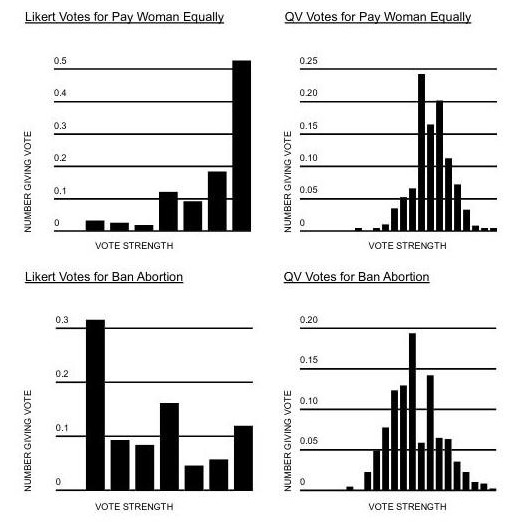
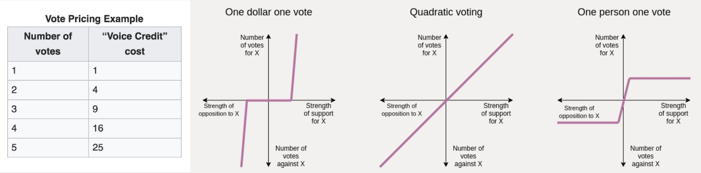
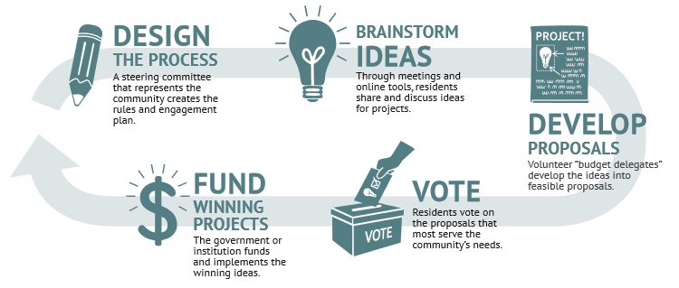
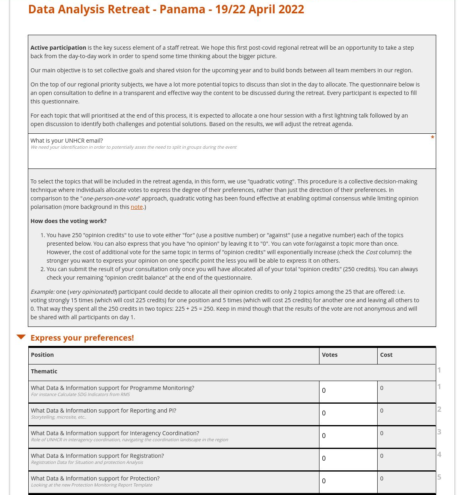

<!-- README.md is generated from README.Rmd. Please edit that file -->

# Quadratic Voting: A practical facilitation method for prioritization process

<!-- badges: start -->
<!-- badges: end -->

Performing prioritization in collective and inclusive way is
challenging. This stage is typically the moment where diverging views
can arise. In the absence of a clear facilitation approach, adverse
effects are likely to occur, leading to decisions that might :

-   Simply replicate previous ‘*status quo*’ from one year to another
    that are just adjusted on the margin years after years.

-   Reflect more the internal ‘*game power*’ within a team, rather than
    the reality of the needs or the aggregated preference of all
    individuals.

Quadratic voting is a cross between a voting budget system and a
one-person-one-vote system. It is an innovative collective
decision-making procedure where individuals allocate votes to express
the degree of their preferences, rather than just the direction of their
preferences. The procedure is designed to address inherent challenges
associated with approaches based on either the “one-person-one-vote” or
“one-dollar-one-vote” method, i.e.:

-   [Voting paradox](https://en.wikipedia.org/wiki/Paradox_of_voting)
    when majority wishes enter in conflict with each other.

-   [Tyranny of the
    majority](https://en.wikipedia.org/wiki/Tyranny_of_the_majority) in
    which a league of individuals may pursues exclusively its own
    objectives at the expense of those of other minorities in the group.

As showcased below, quadratic voting is therefore more effective at both
enabling optimal consensus and limiting opinions polarization than
likert voting.

## How quadratic voting works?

Members of the team simply need to fill a
([xlsform-based](http://xlsform.org)) questionnaire listing all selected
activities:

-   Each respondent has a number of “**opinion credits**” to use to vote
    either “for” (use a positive number) or “against” (use a negative
    number) each of the topics presented below. You can also express
    that you have “no opinion” by leaving it to “0”.

-   Respondent can **vote either “for” or “against” a topic more than
    once**. However, the cost of additional vote for the same topic in
    terms of “opinion credits” will exponentially increase (check the
    *Cost* column): the stronger one want to express his/her opinion on
    one specific point the less he/she will be able to express it on
    others. This element reflects the trade-off particpants are ready to
    consent for.

-   Respondents can submit the result of the consultation only once the
    total “opinion credits” is allocated. Respondents can always check
    their remaining “opinion credit balance” at the end of the
    questionnaire.

The number of opinion credits is linked to the number of position to
vote for. The current form has the limitation of a maximum a 25
positions to vote for (so a maximum of 250 credits) organised in 5
groups with 5 positions per group max

*Example:* one (*very opinionated!*) participant could decide to
allocate all their opinion credits to only 2 topics among (let’s say)
the 25 that are offered: i.e. voting strongly 15 times (which will cost
225 credits) for one position and 5 times (which will cost 25 credits)
for another one and leaving all others to 0. That way they spent all the
250 credits in two topics: 225 + 25 = 250. Keep in mind though that the
results of the vote are not anonymous and will be shared with all
participants on day 1.

After the vote, the compilation of results can be then turned into
weighting measurement for each activity. This provides objective
evidences of views to inform the prioritization of activities (in terms
of time/resources…) according to their precise importance.

# Deliberate & Vote! Mainstreaming participatory approach…

Many areas have been proposed for [quadratic
voting](https://www.radicalxchange.org/media/papers/The_Handbook_for_Radical_Local_Democracy.pdf#page=6),
including not only allocating budgets but also corporate governance in
the private sector, cost-benefit analyses for public goods, more
accurate polling, and other democratic decisions. For instance,
quadratic voting was conducted in an experiment by the Democratic caucus
of the Colorado House of Representatives in April 2019. Lawmakers used
it to decide on their legislative priorities for the coming two years,
selecting among 107 possible bills.

Quadratic voting can be used to implement [participatory
budgeting](https://www.participatorybudgeting.org/what-is-pb/), a
process that allow an effective participation of persons in concerns in
the definition of supporting activities, which is *de facto* an
effective way to enforce the [Accountability to Affected people (AAP)
guidance](https://www.unhcr.org/handbooks/aap/documents/UNHCR-AAP_Operational_Guidance.pdf):

> “Programme decisions are informed by documented consultations with
> persons of concern”.

In such case, in addition to a multi-functional team (MFT) members, the
same voting questionnaire would be filled by representatives and/or
randomly selected members of Forcibly Displaced Population. Results from
each voting assembly can be then compared to re-enforce their
authoritativeness, or at least representativeness.

## What is included in this package

In order to popularize this approach in the field, this package includes
:

-   a **template to implement a quadratic survey** in xlsform. This
    means that such consultation can be easily implemented for instance
    on UNHCR Kobotoolbox server: <http://kobo.unhcr.org>. The order in
    which the activities to vote for are presented in the template is
    randomized for each participant to avoid specific ranking/selection
    effects in the online form. The package include functions to check
    your form is correctly prepared and to directly set up the project
    on Kobotoolbox through the API.

-   some **visualisations to display the results** of quadratic survey
    consultation. see in the vignette example, how quadratic voting has
    been used to decide on the content of an information management
    retreat for UNHCR in the Americas.

-   a **tutorial** explaining re-use the template and the notebook
